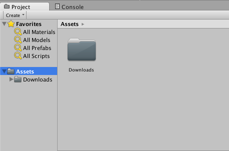
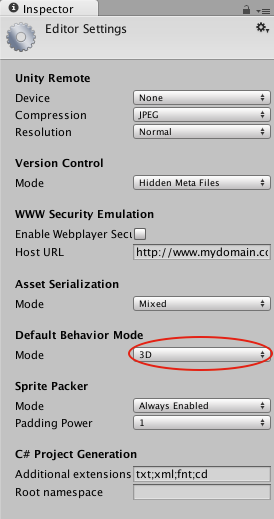
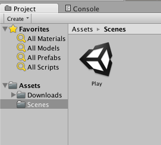
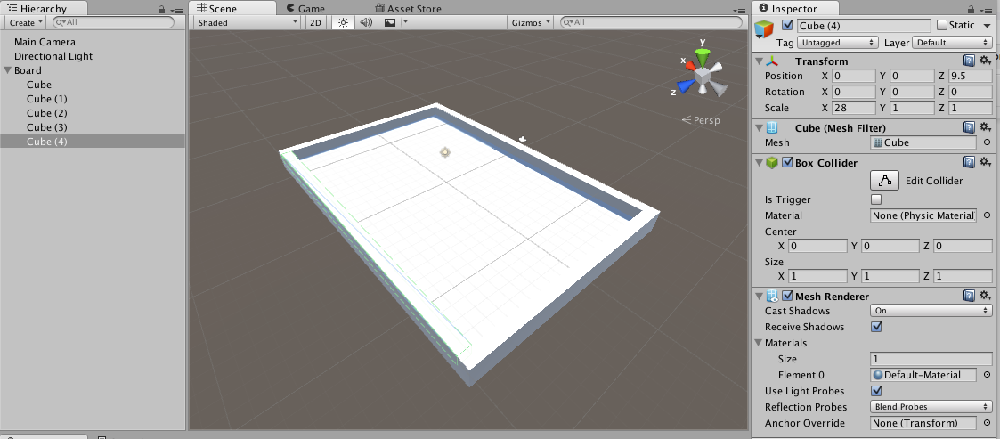
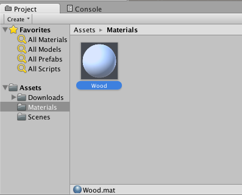
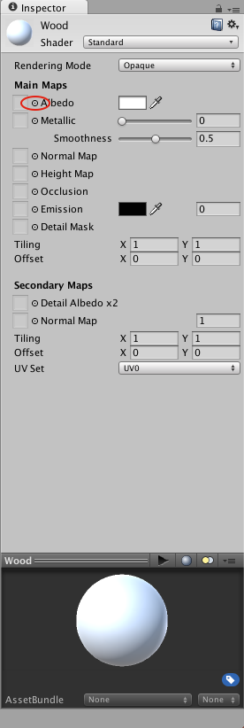
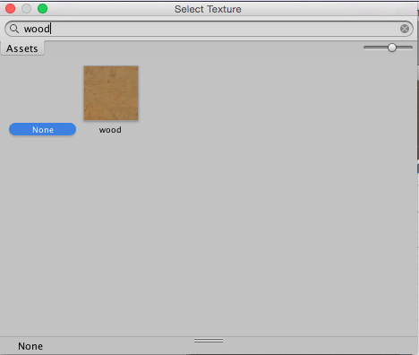
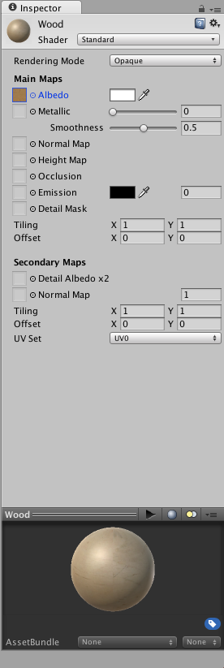
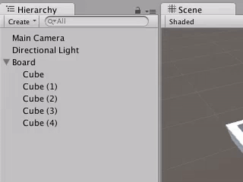
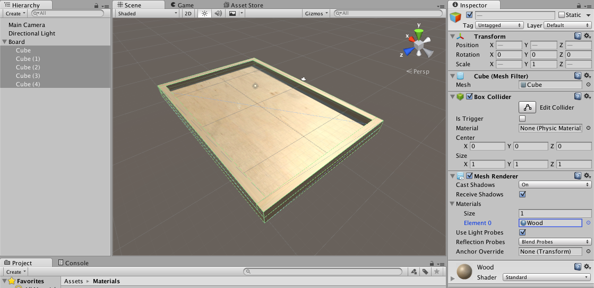

In this tutorial, we’ll show you how make a to wooden [ball-in-maze puzzle](https://en.wikipedia.org/wiki/Ball-in-a-maze_puzzle), like the kind with a two knobs and a marble, complete with a main menu and pause overlay!


By the end of this tutorial, you should feel comfortable:

- Managing Scenes
- Creating overlay menus

You should also gain a better understanding of how physics forces affect objects.

# Let's Begin

> [action]
>
Clone the marbles project and import it into a new 3D Unity project named Marble-Maze. Remember, you can clone to your Desktop using
>
```
cd Desktop
git clone https://github.com/MakeSchool-Tutorials/Marble-Maze-Unity-Starter.git
```
>
It should have some assets in a folder called "Downloads."
>

>
Be sure your project is set up to be 3D.
>

>
Create a new folder called "Scenes" and save the current scene as `Play` in that folder.
>


We’ve used scenes in other tutorials, but what are they, and why have we been using them?

A Unity Scene is a collection of Game Objects that you can load or unload during gameplay. The word "scene" is actually incredibly descriptive of what a Unity Scene is; you can think of a Unity Scene as the equivalent of a scene in a movie or play, with the Game Objects as set pieces, props, and actors. When you switch scenes, you unload the old Game Objects, and then load in the ones in the new scene. By default, objects don’t persist between scenes in Unity, though, you can tell Unity to make certain objects do this, if you ever need to.

We’re going to use Scenes to make our Main Menu totally separate from our Gameplay, since the two of them will follow different logic and since we want them to look significantly different.

# Building Your Game Scene

The first thing we’ll want to make in our tilt-a-ball game is a board we can tilt around.

> [action]
>
Create an Empty Game Object named Board and then add some Cubes as children to it to make a 30 x 20 board with a raised edge. We’ve chosen to use a Cube for the floor here rather than a plane because, when players tilt the board around, we expect them to be able to see the board from below, and a Plane would appear invisible from below, which would seem unrealistic.
>


To make our board a little easier to see and to make it look more realistic, we’re going to cover it with a the wood texture in our downloads folder.

> [action]
>Create a new folder called `Materials`, and, in it, create a new `Material` called `Wood`.
>

>
Select the `Wood` Material, and, in the Inspector, select the little circle next to `Albedo` to set the `Albedo Texture` to the asset "wood."  You can find the asset more easily by typing its name in the search bar in the box that appears.
>

>

>
Double-click the asset to set it.
>

>
Now `Shift` or `Ctrl` select all the Cubes that make up your `Board`’s geometry, and apply the new `Wood` material to them by setting the `Material` with them all selected.
>




Unity’s pretty darn smart in that it lets you set properties on like Game Objects at the same time if you have them all selected!  You can also use multiple selection to see if objects all have the same settings; Unity displays a little bar wherever properties have multiple values across Game Objects, like in the local position of the Cubes above.
