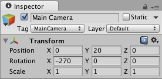

It’s tilting time!

> [action]
>Create a new folder called "Components" and, in it, create a new C# script called `Board.`


Board’s job will be to tilt the Game Object to which it’s attached, based on player inputs.

> [action]
>Attach the Board script to Board either by dragging it on or by selecting Board and using the Add Component button.


> [action]
>Now double-click the Board script to open it in Visual Studio.

Before dealing with inputs, let’s just make it rotate. We’re going to do this using Physics.

> [action]
>Add a new private Rigidbody member variable, and set it in the Start method.

<!-- -->

> [solution]
>
>The code you’ve added should look like this:
>
```
private Rigidbody rb;
>
// Use this for initialization
void Start () {
  rb = GetComponent<Rigidbody>();
}
```

<!-- -->

<!-- n.b. this should really use FixedUpdate, because we're doing stuff with physics -->

> [action]
>Now in the Update method, add the following lines:
>
```
float dt = Time.deltaTime;
>
Vector3 direction = new Vector3(0,1,0);
float torqueRate = 100;
>
rb.AddRelativeTorque(direction * torqueRate * dt);
```

<!-- -->

> [action]
>Then save the component, add a Rigidbody component to Board, and uncheck "Use Gravity."


> [action]
>Run the Scene, and the Board should slowly rotate!  To get a good view, we recommend setting your Main Camera to position (0,20,0) and rotation (90,0,0).




Our code makes the board rotate by applying something known as "torque."  Torque twists things around, like screws and door knobs, and is expressed pointing along an imaginary rod you could grab and twist your hand around in the same way the object twists. This imaginary rod is called the `axis of rotation,` and our code represents that with the variable `direction,` which we’ve chosen to point along the y axis.

> [action]
Try changing the values in direction to see what happens. Try and predict how your changes will affect the model to gain better intuition for how torque works.


When you did this, you may have noticed that bigger numbers made the board spin faster and faster. This is because how big or small torque is makes it more or less twisty.

The bigness of torque in our code comes not only from the values in direction itself, but also from a variable we multiply it with, torqueRate, which is how much torque we want to apply per second. We’ve multiplied direction by torqueRate, and the amount of time passed during this frame, to get the torque we should apply just this frame. If it helps, think about it in terms of units:

```
direction (unitless) * torque/second * seconds = torque
```

> [action]
Just like you did with the direction variable, try changing the torqueRate variable to see torque go up or down. What do you think will happen if you make it negative?

 
