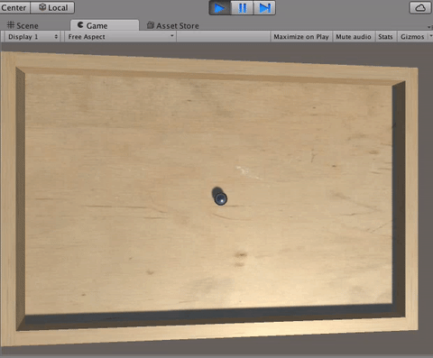

> [action] Now that you have some intuition for how torque works, write code to make the board twist about the x axis when you press the up or down arrow keys and twist about the z axis when you press the left or right arrow keys.

Since code often doesn’t work exactly as intended the first time, be sure you know how to access the console.  You can view the Console in Unity by selecting the Console tab next to the Project tab at the bottom.  You can also drag this tab to move where the Console is and make it visible at the same time as the Project Panel.


You may find it useful to write to the Console using Debug.Log() statements.

Be sure to save your code before you run the Scene!


> [solution]
>Here’s how we wrote it:
>
>```
>using UnityEngine;

>using System.Collections;

>public class Board : MonoBehaviour {

>public float torqueRate;

>private Rigidbody rb;

>// Use this for initialization

>void Start () {

>rb = GetComponent<Rigidbody>();

>}

>// Update is called once per frame

>void Update () {

>float dt = Time.deltaTime;

>float inputH = Input.GetAxis("Horizontal");

>float inputV = Input.GetAxis("Vertical");

>Vector3 direction = new Vector3(inputV,0,-inputH);

>rb.AddRelativeTorque(direction * torqueRate * dt);

>}

>}
>```

We chose to make torqueRate public so that we could adjust it in the Editor to find a good value.  The value we set for now is 1000.

We’ve also reversed the horizontal input, because we thought it felt more natural for the twist to go in that direction.

You may have noticed that the Board doesn’t stop rotating very easily once it’s started, making it kind of difficult to control.  To fix this, we can increase the Board’s **"Angular Drag"**, which affects how quickly it slows down its rotation.

> [action] Go ahead and set the Board’s Angular Drag to a value that feels good.  We found that the value of 1 worked pretty well.  Once you build the game, you may want to change both this and the torqueRate value, so keep that in mind.


Now let’s add a ball to our game.

Create a Sphere in your Scene, but not parented to the Board, and name it "Ball."


To make the Ball a little prettier, create a new Material called Ball in the Materials folder, set its Metallic value to 1, Smoothness value to 0.8, Albedo color to 808080FF, and make the Ball object use this Material.


Now to make the Ball roll, give it a Rigidbody component.  Press Play and…


Suddenly the board falls?  Why do you think this is?

> [solution]It’s because the Rigidbody on our Board is interacting with the Rigidbody on our Ball.  Although our Board is correctly not affected by gravity, our Ball correctly *is*.  When gravity acts on the Ball, it falls down, and, when it falls onto the Board, it exerts force on the Board.

We really don’t want our Board to remain fixed in space.

Thankfully, Rigidbodies are built with ability to fix them in rotation and/or translation.

>[action] Select Board, expand the "Constraints" section of the Rigidbody component by clicking the little arrow, and check all of the position constraints.  Also check the y rotation constraint, just in case, because we never want the Board to rotate in the y direction, and forces might try and make it do that.


Now run the Scene.  Better?



Definitely, but there’s still a problem.  It’s now *really really really* difficult to rotate the Board back when the Ball rolls onto one side.

This is because, though we’ve set constraints, the Ball is still exerting force on the Board, and that force is acting against our torque.

To give you a bit of a better understanding of how torque and force are related, and why the Ball’s making it difficult to tilt our Board:
>[info] Torque is caused by applying a force some distance away from the center of rotation of a thing, like applying force the handle of a wrench to turn it around.  The farther away that force is applied, the stronger the torque.  This is why door handles are located far away from the hinges rather than right next to them, so that you don’t have to apply as much force to open the door.  If you want to gain some intuition for this, find an open door and try to close it by pushing with just one finger, starting closest to the hinges, then working closer to the handle.  Depending on the door, it can be *really* tough when you’re close to the hinges, but super simple by the handle.

Now, our problem is that the force the Ball is exerting on the Board is so strong that it’s making it nearly impossible for us to tilt the Board once the Ball reaches the edge of the Board, thus applying max torque.

How can we reduce the amount of force the Ball exerts on the Board?

To solve this problem, we’ll also want to look a little more closely at what force is.

>[info] Force is a thing that pushes in a direction with a certain strength.  When gravity acts on an object that’s on the ground, the object exerts a force on the ground based on a property of the object known as "mass," which is basically how much stuff it has.  A less-massive object will exert less force, but a more massive one will exert more force.  This is what gives objects weight and why carrying a backpack full of textbooks is more tiring than carrying an empty backpack.

If we want to reduce the amount of force that the Ball is exerting on the Board, one way to do this is to reduce the Ball’s mass.

>[action] Select Ball and set its Rigidbody’s mass to 0.1.


The Ball will still affect the Board, and you’ll feel it pushing down, which is realistic, but now the Board will be much easier to move, even when the Ball is on the outer edge.  It also makes a lot more sense to have a marble that is 10x less massive than the board than a marble and a board that are the same masses.
