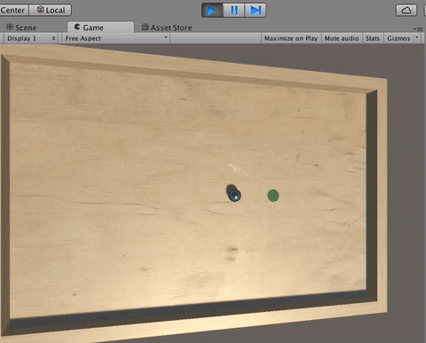
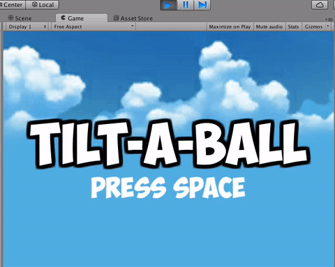

To make our game loop complete, let’s add a Goal to our Board.

>[action]
>Create an Empty Game Object as a child of Board and name it Goal.


>[action]
>Give Goal a Sphere Collider set to Trigger, and a Sphere as a child.  Remove the child Sphere’s Sphere collider, set its y scale to 0, and set its y position to -0.49.  This should make the Goal look like little circle on the Board.  To see it better, position the Goal somewhere other than the Ball’s start position.


>[action]
>To make the Goal stand out more, create a new Material for it named "Goal" in the Materials folder, with the Albedo Color set to 008000FF, and apply it to Goal’s Sphere.


>[action]
>Now add to Goal a Component called "Goal" that logs a message whenever a Ball collides with it.  As a hint, you may need to modify Ball in some way to make this work.

Try to do it yourself, then check our solution:

>[solution]
>
>Here is what our code looks like:
>
```
using UnityEngine;
>
using System.Collections;
>
public class Goal : MonoBehaviour {
>
  void OnTriggerEnter(Collider col) {
    if (col.CompareTag("Player")) {
      Debug.Log("WIN");
    }
  }
}
```
>
>In order to make our code work, we added the "Player" tag to Ball.

Great!  Remember where you have your log message, because we’re going to come back to it to implement our Scene switch.

>[action]
>For now though, save your current Scene (File->Save Scene or Ctrl-S) and create a new one (File->New Scene or Ctrl-N).

<!-- -->

>[action]
>Save this new Scene as "Main" in the Scenes folder.  This will be our Main Menu.


>[action]
>Create a new Canvas in the Scene (GameObject->UI->Canvas).  Select the Canvas Game Object and set its Canvas Scalar component’s UI Scale Mode to Scale With Screen Size.


A Canvas is an object on which we can draw UI (user interface) elements, and the UI Scale Mode determines how that UI scales.  We’ve suggested this option because it makes UI elements generally fit to any resolution we use by scaling.

You may have noticed, by the way, when you created the Canvas that an Event System was added to your Hierarchy as well.  The Event System makes some UI elements have default behaviours, for example the Button component respond will automatically to click and touch inputs if there's an Event System.  We won’t be dealing with these now, so you can delete this object if you’d like, but it shouldn’t hinder you to leave it either.

>[action]
>Create a UI Text Game Object as a child of the Canvas (right-click Canvas, UI->Text).


Game Objects created on Canvas by default have Rect Transforms instead of Transforms.  Rect Transforms look different than Transforms because Rect Transforms define a rectangle, whereas Transforms define a coordinate system.

>[action]
>Select the little box with the red cross-hair, above "Anchors," and, holding Shift and Alt, select the lower right option to make the Text’s rectangle expand to fill the Canvas.


The menu of Anchor Presets we just used allows for different methods of defining the rectangle on which this UI element is drawn.  The default was a centered object with a width and height, but we changed it to stretch to fill the space by being 0 pixels away from the edges of its parent.

>[action] Now set the Text’s Text component properties: set the Text field to "Tilt-A-Ball"; set the font to ObelixPro-cyr; set the size to 100; and set alignment to Centered, both horizontally and vertically.


>[info] In order to best see the text, you may find it helpful to select the Canvas Game Object in the Hierarchy, hover over the Scene View, and press "f" to center on the Canvas.  You may need to rotate the view around with the widget in the upper right of the Scene View.

To make the text **bolder**, we also chose to set the color to white, and add a few Outline components progressively farther away.


To make the Scene overall more fantastical, we also changed the Skybox for this scene by opening the Lighting menu (Windows->Lighting) and setting the Skybox to "Sunny 01 A."


>[action]
>Now save this Scene and open the Build Settings menu (File->Build Settings or Ctrl-Shift-B) and press the "Add Open Scenes" button to add the current scene to the list of Scenes Unity will consider part of this game.


Open Play and add this scene as well.


Now go back to the spot in your code where you logged whenever your Ball reached your Goal.

Add the following to the top of the file:

```
using UnityEngine.SceneManagement;
```

Then replace your log statement with the following:

```
SceneManager.LoadScene("Main");
```

Now when you roll your ball over the goal, the game should switch to the Main Menu!



#Switching From the Main Menu

We, of course, also want to be able to go from our Main Scene to our Play Scene.

>[action] Go back to Main and create an Empty Game Object in the Scene named "Scene" and add a new component to it (located in the Components folder, of course) named “SceneMain.”


>[action] Now make SceneMain switch to the Play Scene when the player presses the spacebar.  As a hint, Input.GetKeyDown(KeyCode.Space) returns true when the player presses the spacebar.

<!-- -->

>[solution]
>
>Our component looks like this:
>
```
using UnityEngine;
using System.Collections;
>
using UnityEngine.SceneManagement;
>
public class SceneMain : MonoBehaviour {
>
  // Use this for initialization
  void Start () {
>
  }
>
  // Update is called once per frame
  void Update () {
>
    if (Input.GetKeyDown(KeyCode.Space)) {
      SceneManager.LoadScene("Play");
    }
  }
}
```

You may have noticed when you implemented this that the lighting in Play suddenly looks really odd when you switch to that Scene from Main vs when you play the Scene itself.


This is because, in Unity, by default, the Skybox’s contribution to a Scene’s lighting (General Illumination, or GI) is saved temporarily when you’re editing that Scene, so you get to see how it looks when you run the Scene itself.  When you load a Scene from another one though, the GI hasn’t been calculated anywhere, so Unity lights the Scene without accounting for the GI's contribution.

>[action]
>To remedy this, open up the Play Scene, then open up the Lighting Window, uncheck the "Auto" button at the bottom, and press “Build.”  A folder should be added to the Scenes folder that contains the lighting information for this Scene, so that Unity can use that info to light the scene later.  When we built the lights for Play, we also switched the Skybox to be the same as the one in Main, because we thought it was a little prettier than the default.


#Polishing our Main Menu

Before we go on to the next step, we’re going to add some text to our Main Menu to let the player know what button to press to start the game, since it’s important to let players know how to play.

>[action] In the Main Scene, add a Text Game Object to the Canvas Game Object.  Set its Anchor Presets to "Middle" and “Stretch”; set its Left to 0, Right to 0, Height to 30, and y to -100; set its Font Size to 50, Alignment to centered both horizontally and vertically, and its Vertical Overflow to “Overflow”; then make its Text say something like “Press Space.”  We’ve made our text white and also used the font we used in the title.


For extra flair, we’ve created and added a PulseText component to the Text with the following code:

```
using UnityEngine;
using System.Collections;
using UnityEngine.UI;

public class PulseText : MonoBehaviour {

  public bool useUnscaledTime;
  public float period;
  private float timer;

  private Text text;
  private Color startColor;
  private Vector2 startScale;

  // Use this for initialization
  void Start () {

    text = GetComponent<Text>();
    startColor = text.color;
    startScale = transform.localScale;

  }

  // Update is called once per frame
  void Update () {

    timer -= useUnscaledTime ? Time.unscaledDeltaTime : Time.deltaTime;

    if (timer < 0) {timer = period;}

    float percentage = period == 0 ? 0 : timer/period;
    float pulse = (0.5f + 0.5f * Mathf.Sin(percentage * Mathf.PI * 2)) * 0.5f + 0.5f;

    text.color = startColor * new Color(1,1,1,pulse);
    transform.localScale = startScale * (pulse * 0.5f + 0.5f);

  }
}
```

Feel free to do this as well.  We’ve set it to use unscaled time and to have a pulse period of 2 seconds.



