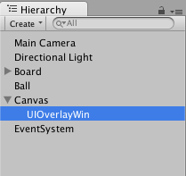
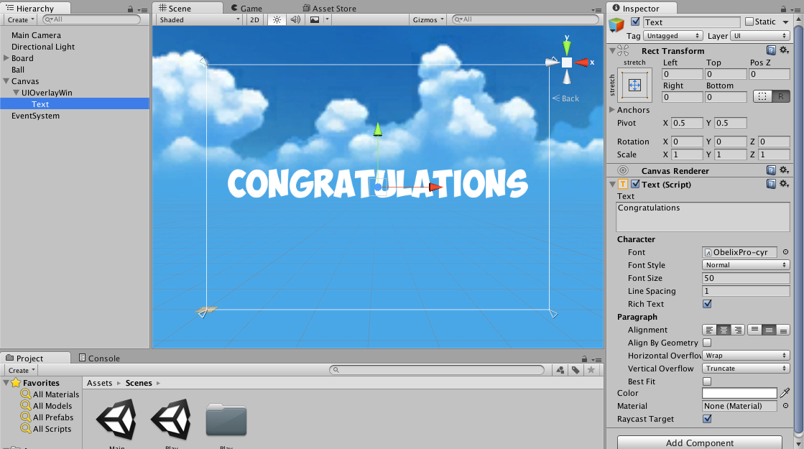
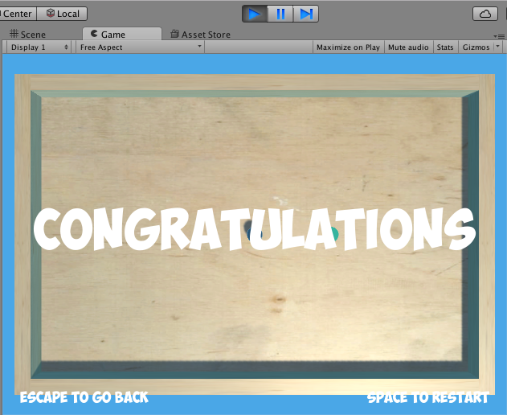
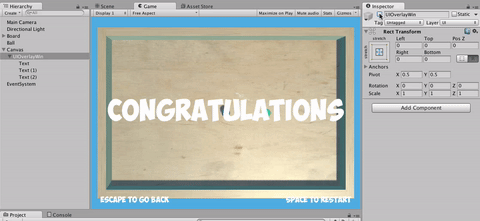

We now have a game that someone could play from start to finish, and a Main Menu we can navigate to and from.

Most game, however, don’t just take you back to the Main Menu when you beat them; they usually at least give you the option to continue playing (or in our case, to "play again," since we’ll only make one level) or to go back.

To do this, we’re going to change our end-game logic to bring up an overlay containing some text telling the players that they have won and instructing them how to navigate from there.

>[action] To begin, add a Canvas to Play and on that Canvas Game Object, add an Empty Game Object and name it "UIOverlayWin."



Set its Anchor Presets and Rect Transform settings to fill the Canvas, and add a Text Game Object as a child with centered text that says "Congratulations."  To make our text prettier, we’ve made our text white and used the font from before.



Below it, add some text that says something like "Space to Restart" and “Escape to go Back.”  We’ve used two labels and set their Anchor Presets to bottom right and left respectively, holding Shift to also set Pivots.  The Pivots in x and y are floats between 0 and 1 that represent the percentage of the way along that axis that an object is positioned to, so for an object to be flush with the bottom right corner, it should have a Pivot of (1,0) and a position of (0,0).  If positioning this text is confusing though, don’t sweat it.  Thankfully, we’ll be dealing with VR soon enough, and VR UI is very different!


If we were to run our Play Scene now, we’d see this overlay on top of it, but that’s not exactly what we want.



We only want this object to become visible when the player wins.

In Unity, a convenient way to hide or show objects is to set them active or inactive.  You can do this in the Editor by checking or unchecking the little checkbox by the Game Object’s name in the Inspector.


An active Game Object will update all its active components every frame, but an inactive Game Object won’t update any of its components.

>[action] See what happens when you check or uncheck the UIOverlayWin’s active checkbox.



To do this in code, we can use the function foo.SetActive(true) or foo.SetActive(false), where foo is a GameObject.

Recall that to get a reference of a GameObject in another, you can declare a public member variable GameObject and then drag the other object into that field in the Inspector.

>[action] Try replacing your current win implementation with one that makes this menu pop up.


>[solution]
>
>We did this by modifying the code in Goal to look like this:
>
```
using UnityEngine;
using System.Collections;
//using UnityEngine.SceneManagement;
>
public class Goal : MonoBehaviour {
>
  public GameObject overlayWin;
>
  void OnTriggerEnter(Collider col) {
    if (col.CompareTag("Player")) {
      //SceneManager.LoadScene("Main");
      overlayWin.SetActive(true);
    }
  }
}
```
>
>This code required us to drag the UIOverlayWin >GameObject into the Overlay Win field of Goal that we >created with our public member variable overlayWin.
>
>We also unchecked UIOverlayWin so that it starts out the game inactive.
>
>We’ve commented out the SceneManagment code that we used before, because we’re no longer using it, but we may still want to refer back to it.]

Our new implementation doesn’t yet provide controls to allow the player to restart the game or go back to the main menu, so let’s add that.

Remember that an inactive Game Object doesn’t run any of its components, but an active one does.  With that knowledge, we know we can put the logic to restart our scene onto our UIOverlayWin Game Object, because it won’t run the code until it’s active.

>[action] Create a component on UIOverlayWin that restarts the Scene when the player presses "space" and that goes back when the player presses “escape.”  As a hint, Input.GetKeyDown(KeyCode.Escape) returns true when the player presses “escape.”  Also, if you’re stuck on how to restart the level, what do you think would happen if you load the scene you’re currently running?


>[solution] We wrote a component named UIOverlayWin, added it to the UIOverlayWin Game Object, and gave it the following code:
>
```
using UnityEngine;
using System.Collections;
using UnityEngine.SceneManagement;
>
public class UIOverlayWin : MonoBehaviour {
>
  private bool isLoading;
>
  // Use this for initialization
  void Start () {
>
  }
>
  // Update is called once per frame
  void Update () {
>
    if (isLoading) {return;}
>
    if (Input.GetKeyDown(KeyCode.Space)) {
      isLoading = true;
      SceneManager.LoadScene(SceneManager.GetActiveScene().name);
    }
    else if (Input.GetKeyDown(KeyCode.Escape)) {
      isLoading = true;
      SceneManager.LoadScene("Main");
    }
  }
  }
```
>If you noticed the variable isLoading, this serves as a flag to prevent us from calling any loading method more than once in this scene.  We’ve used the fact that C# initializes its bools to false to know that it will be false until we set it to be true.
>
>You may have also noticed that we get the name of the Play scene by saying "SceneManager.GetActiveScene().name" rather than just “Play.”  While “Play” would be shorter, we’ve chosen this implementation because it makes our code rely less on the specific name of the Scene.  Doing this is good because it means that if we ever change the scene’s name, our code should still work.  “Main,” however relies on the name being exactly this.
