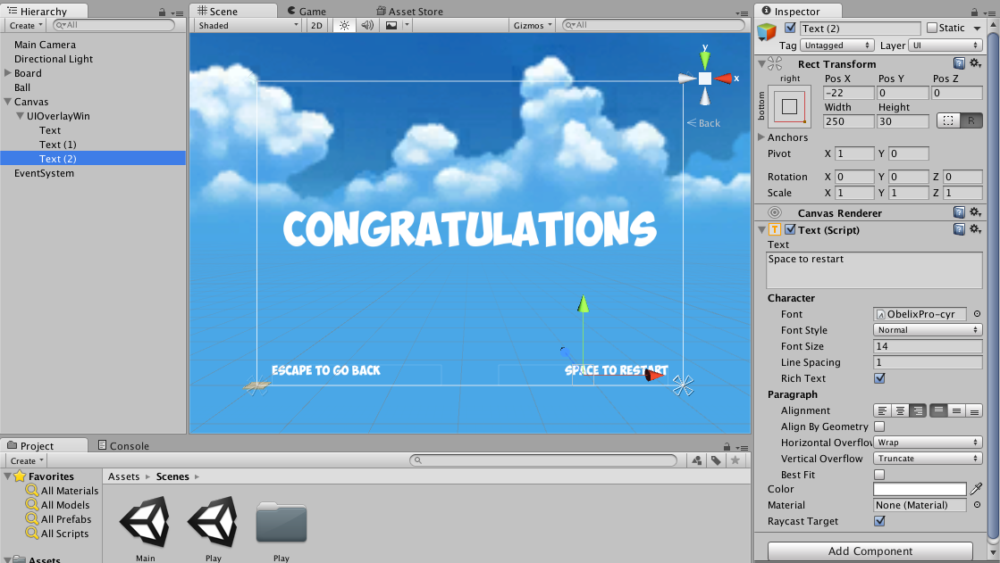
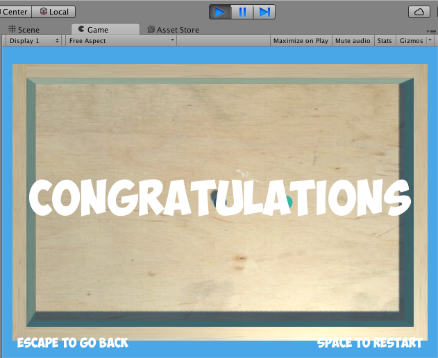
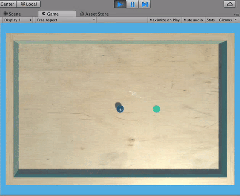
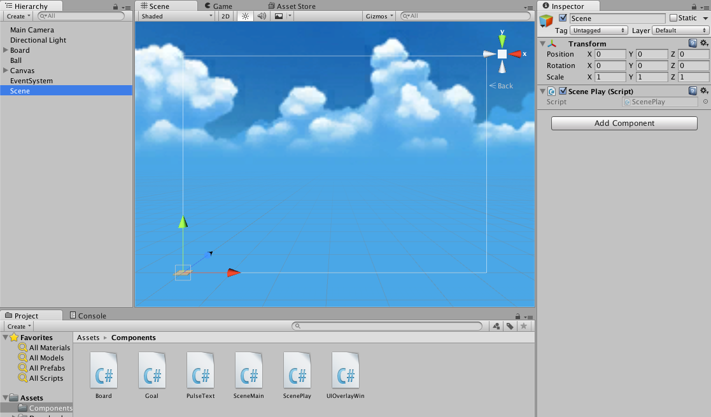

We now have a game that someone could play from start to finish, and a Main Menu we can navigate to and from.

Most game, however, don’t just take you back to the Main Menu when you beat them; they usually at least give you the option to continue playing (or in our case, to "play again," since we’ll only make one level) or to go back.

To do this, we’re going to change our end-game logic to bring up an overlay containing some text telling the players that they have won and instructing them how to navigate from there.

>[action] To begin, add a Canvas to Play and on that Canvas Game Object, add an Empty Game Object and name it "UIOverlayWin."


Set its Anchor Presets and Rect Transform settings to fill the Canvas, and add a Text Game Object as a child with centered text that says "Congratulations."  To make our text prettier, we’ve made our text white and used the font from before.


Below it, add some text that says something like "Space to Restart" and “Escape to go Back.”  We’ve used two labels and set their Anchor Presets to bottom right and left respectively, holding Shift to also set Pivots.  The Pivots in x and y are floats between 0 and 1 that represent the percentage of the way along that axis that an object is positioned to, so for an object to be flush with the bottom right corner, it should have a Pivot of (1,0) and a position of (0,0).  If positioning this text is confusing though, don’t sweat it.  Thankfully, we’ll be dealing with VR soon enough, and VR UI is very different!



If we were to run our Play Scene now, we’d see this overlay on top of it, but that’s not exactly what we want.



We only want this object to become visible when the player wins.

In Unity, a convenient way to hide or show objects is to set them active or inactive.  You can do this in the Editor by checking or unchecking the little checkbox by the Game Object’s name in the Inspector.


An active Game Object will update all its active components every frame, but an inactive Game Object won’t update any of its components.

>[action] See what happens when you check or uncheck the UIOverlayWin’s active checkbox.


To do this in code, we can use the function foo.SetActive(true) or foo.SetActive(false), where foo is a GameObject.

Recall that to get a reference of a GameObject in another, you can declare a public member variable GameObject and then drag the other object into that field in the Inspector.

>[action] Try replacing your current win implementation with one that makes this menu pop up.


>[solution]
We did this by modifying the code in Goal to look like this:
>
>```
>using UnityEngine;
>
>using System.Collections;
>
>//using UnityEngine.SceneManagement;
>
>public class Goal : MonoBehaviour {
>
>public GameObject overlayWin;
>
>void OnTriggerEnter(Collider col) {
>
>if (col.CompareTag("Player")) {
>
>//SceneManager.LoadScene("Main");
>
>overlayWin.SetActive(true);
>
>}
>
>}
>
>}
>```
>
>This code required us to drag the UIOverlayWin >GameObject into the Overlay Win field of Goal that we >created with our public member variable overlayWin.
>
>We also unchecked UIOverlayWin so that it starts out the game inactive.

>We’ve commented out the SceneManagment code that we used before, because we’re no longer using it, but we may still want to refer back to it.]

Our new implementation doesn’t yet provide controls to allow the player to restart the game or go back to the main menu, so let’s add that.

Remember that an inactive Game Object doesn’t run any of its components, but an active one does.  With that knowledge, we know we can put the logic to restart our scene onto our UIOverlayWin Game Object, because it won’t run the code until it’s active.

>[action] Create a component on UIOverlayWin that restarts the Scene when the player presses "space" and that goes back when the player presses “escape.”  As a hint, Input.GetKeyDown(KeyCode.Escape) returns true when the player presses “escape.”  Also, if you’re stuck on how to restart the level, what do you think would happen if you load the scene you’re currently running?



>[solution] We wrote a component named UIOverlayWin, added it to the UIOverlayWin Game Object, and gave it the following code:
>
>```
>using UnityEngine;
>
>using System.Collections;
>
>using UnityEngine.SceneManagement;
>
>public class UIOverlayWin : MonoBehaviour {
>
>private bool isLoading;
>
>// Use this for initialization
>
>void Start () {
>
>}
>
>// Update is called once per frame
>
>void Update () {
>
>if (isLoading) {return;}
>
>if (Input.GetKeyDown(KeyCode.Space)) {
>
>	isLoading = true;
>
>SceneManager.LoadScene(SceneManager.GetActiveScene().name);
>
>}
>
>else if (Input.GetKeyDown(KeyCode.Escape)) {
>
>	isLoading = true;
>
>SceneManager.LoadScene("Main");
>
>}
>
>}
>
>}
>```
If you noticed the variable isLoading, this serves as a flag to prevent us from calling any loading method more than once in this scene.  We’ve used the fact that C# initializes its bools to false to know that it will be false until we set it to be true.

You may have also noticed that we get the name of the Play scene by saying "SceneManager.GetActiveScene().name" rather than just “Play.”  While “Play” would be shorter, we’ve chosen this implementation because it makes our code rely less on the specific name of the Scene.  Doing this is good because it means that if we ever change the scene’s name, our code should still work.  “Main,” however relies on the name being exactly this.

The last two features we’d like to implement are a timer, so that players can challenge themselves to improve their time, and a pause overlay, from which players can continue or exit.

First, create an Empty Game Object in the Play Scene and name it Scene.  Create a new component on it and name it "ScenePlay."  This component will keep track of our timer and we’ll create UI to display the current time.



Open up the ScenePlay component in Visual Studios and add a private member variable to track the time:

private float timer;

Then add the following code to increment the timer each frame:

timer += Time.deltaTime;

Time.deltaTime is the amount of time that passed this frame.  If we have a framerate of 60 frames per second, Time.deltaTime *should* be around 1/60th of a second, but it’s difficult (possibly impossible) to predict exactly how long a frame will take to process, so instead the computer tells us how long the frame actually took.  We add this to our timer so that we can track how much time has passed overall.

To display the timer, we’ll want to populate the Text field of some UI with a string representing the time.  We have some code that will give you a string of the time, represented like "min:sec:millisec" and you can see that by adding the following code to your Update method:

int ms = (int)(((float)(timer - (int)timer)) * 1000);

int m = (int)timer / 60;

int s = (int)(timer - m * 60);

string timeString = m.ToString("D2") + ":" + s.ToString("D2") + ":" + ms.ToString("D3");

Debug.Log(timeString);

Run it and you should see times print out to the Console.


Now display that time as Text on the Canvas.  As a hint, you can get a reference to any component Foo by writing "public Foo foo" and dragging an object with that component into the field in the Editor.  In order to use the Text component in a script, you’ll also need to add “using UnityEngine.UI” to the top of that file.


To be thorough, be sure to watch the timer change from 00:59:999 to 01:00:00.  This takes a minute, but it’s better to wait a minute now and get it right than to have your timer break after a minute of play!

[solution: We modified our ScenePlay component to look like this:

using UnityEngine;

using System.Collections;

using UnityEngine.UI;

public class ScenePlay : MonoBehaviour {

private float timer;

public Text timerText;

// Use this for initialization

void Start () {

}

// Update is called once per frame

void Update () {

timer += Time.deltaTime;

int ms = (int)(((float)(timer - (int)timer)) * 1000);

int m = (int)timer / 60;

int s = (int)(timer - m * 60);

string timeString = m.ToString("D2") + ":" + s.ToString("D2") + ":" + ms.ToString("D3");

timerText.text = timeString;

}

}

The public variable timerText references a Text Game Object we added to our Canvas Game Object.

In order to make the text not move around whenever numbers changed, we also used the fixed-width font, absender1.

]

There’s a problem though.  Our timer doesn’t stop when our game stops.  Right now, the logic to stop our timer is in our Goal, but our timer is running on our Scene Game Object.

To fix this, instead of making our Goal launch the win UI, let’s make ScenePlay launch the win UI if it detects that the Goal has been reached by the player.

To do this, create a reference to Goal from ScenePlay using a member variable and implement a HasBeenReached method on Goal that will return a bool if it’s been reached by the Ball.  Then, in ScenePlay, check to see if the Goal has been reached.  If it has, launch the UI.

Hint: you may find it helps to make the UI referenced from ScenePlay rather than Goal.

[solution: We’ve modified both ScenePlay and Goal.  Our new implementation of ScenePlay looks like this:

using UnityEngine;

using System.Collections;

using UnityEngine.UI;

public class ScenePlay : MonoBehaviour {

private float timer;

public Text timerText;

public Goal goal;

private bool hasGameEnded;

public GameObject overlayWin;

// Use this for initialization

void Start () {

}

// Update is called once per frame

void Update () {

if (hasGameEnded) {return;}

timer += Time.deltaTime;

int ms = (int)(((float)(timer - (int)timer)) * 1000);

int m = (int)timer / 60;

int s = (int)(timer - m * 60);

string timeString = m.ToString("D2") + ":" + s.ToString("D2") + ":" + ms.ToString("D3");

timerText.text = timeString;

hasGameEnded = goal.hasBeenReached;

if (hasGameEnded) {

overlayWin.SetActive(true);

}

}

}

The public variables goal and overlayWin have been set by dragging the appropriate Game Objects into the fields in the Editor.

Our new implementation of Goal looks like this:

using UnityEngine;

using System.Collections;

//using UnityEngine.SceneManagement;

public class Goal : MonoBehaviour {

//public GameObject overlayWin;

private bool _hasBeenReached;

public bool hasBeenReached {

get {

return _hasBeenReached;

}

}

void OnTriggerEnter(Collider col) {

if (col.CompareTag("Player")) {

//SceneManager.LoadScene("Main");

//overlayWin.SetActive(true);

_hasBeenReached = true;

}

}

}

The funny notation "get" under the member variable hasBeenReached marks a getter for this property in C#.  “set” can be used in a similar way, where the variable “value” is used as the passed-in value.  We have a “get” but no “set” because we want this property to be read-only for other classes.  That way, some other class can’t accidentally set the Goal’s hasBeenReached property.

]

Now when you run the Scene, the timer should stop when you win!


To make things a little prettier, by the way, we’ve added a stretched Image behind our Text as a child of UIOverlayWin with an alpha of 128 and given our "Congratulations" text a PulseText component with unscaled time checked and a period of 1.

Our game is basically complete, but it would be really nice if it had a pause overlay that pauses our game when you press "escape" and unpauses when you press “escape” again.

To do this, it’s helpful to know that calling "Time.timeScale = 0" is a handy way of making the physics in the game freeze, and “Time.timeScale = 1” is a handy way of making everything move again.

Think you’re up for it?  Try implementing a pause overlay.


[solution: We implemented the Pause mechanic by modifying ScenePlay to look like this:

using UnityEngine;

using System.Collections;

using UnityEngine.UI;

public class ScenePlay : MonoBehaviour {

private float timer;

public Text timerText;

public Goal goal;

private bool hasGameEnded;

public GameObject overlayWin;

public GameObject overlayPause;

// Use this for initialization

void Start () {

}

// Update is called once per frame

void Update () {

if (hasGameEnded && Time.timeScale != 0) {return;}

if (Input.GetKeyDown(KeyCode.Escape)) {

Time.timeScale = 0;

overlayPause.SetActive(true);

}

timer += Time.deltaTime;

int ms = (int)(((float)(timer - (int)timer)) * 1000);

int m = (int)timer / 60;

int s = (int)(timer - m * 60);

string timeString = m.ToString("D2") + ":" + s.ToString("D2") + ":" + ms.ToString("D3");

timerText.text = timeString;

hasGameEnded = goal.hasBeenReached;

if (hasGameEnded) {

overlayWin.SetActive(true);

}

}

}

Note that we’ve also changed our blocking condition at the beginning of our Update method to include a check for whether or not Time.timeScale is 0.  This is because, if the game is already paused, we don’t want to check any of our gameplay logic, especially not the logic that would let us make our pause overlay active.

We added a new component, which we named UIOverlayPause, to the ovelayPause Game Object we reference here.  The UIOverlayPause component looks like this:

using UnityEngine;

using System.Collections;

public class UIOverlayPause : MonoBehaviour {

// Use this for initialization

void Start () {

}

// Update is called once per frame

void Update () {

if (Input.GetKeyDown(KeyCode.Escape)) {

Time.timeScale = 1;

gameObject.SetActive(false);

}

}

}

We’ve made the pause overlay responsible for unpausing and hiding itself, though this could also have been done from within ScenePlay if we had wanted.  It’s a matter of preference.

]

Congratulations!  You now have a ball-in-maze puzzle!  All that’s left is to build the maze and tweak parameters as you see fit.  Maybe you think the board tilts painfully slowly.  Maybe players say the ball is too big.  Maybe you just don’t like the way the background looks.

Take a moment to at least build the maze and play around with your creation, and, if you would like, feel free to make the maze truly unique!

(We’ve added some glass on top to prevent cheaters from flipping the ball over the walls, and added some UI to indicate controls to the players)

If you’d like to share this game with friends, open up the Build Settings and create a Build of the game to a folder somewhere using the Build button.
