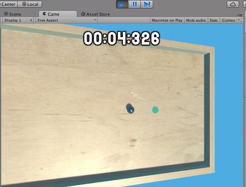

The last two features we’d like to implement are a timer, so that players can challenge themselves to improve their time, and a pause overlay, from which players can continue or exit.

>[action] First, create an Empty Game Object in the Play Scene and name it Scene.  Create a new component on it and name it "ScenePlay."  This component will keep track of our timer and we’ll create UI to display the current time.


Open up the ScenePlay component in Visual Studios and add a private member variable to track the time:

```
private float timer;
```
Then add the following code to the Update() function to increment the timer each frame:

```
timer += Time.deltaTime;
```

>[info]
>Time.deltaTime is the amount of time that passed this frame.  If we have a framerate of 60 frames per second, Time.deltaTime *should* be around 1/60th of a second, but it’s difficult (possibly impossible) to predict exactly how long a frame will take to process, so instead the computer tells us how long the frame actually took. We add this to our timer so that we can track how much time has passed overall.

To display the timer, we’ll want to populate the Text field of some UI with a string representing the time.  We have some code that will give you a string of the time, represented like "min:sec:millisec" and you can see that by adding the following code to your Update method:

```
int ms = (int)(((float)(timer - (int)timer)) * 1000);
int m = (int)timer / 60;
int s = (int)(timer - m * 60);

string timeString = m.ToString("D2") + ":" + s.ToString("D2") + ":" + ms.ToString("D3");

Debug.Log(timeString);
```
Run it and you should see times print out to the Console.


>[action] Now display that time as Text on the Canvas.  As a hint, you can get a reference to any component Foo by writing "public Foo foo" and dragging an object with that component into the field in the Editor.  In order to use the Text component in a script, you’ll also need to add “using UnityEngine.UI” to the top of that file.


To be thorough, be sure to watch the timer change from 00:59:999 to 01:00:00.  This takes a minute, but it’s better to wait a minute now and get it right than to have your timer break after a minute of play!

>[solution]
>
We modified our ScenePlay component to look like this:
>
```
using UnityEngine;
using System.Collections;
using UnityEngine.UI;
>
public class ScenePlay : MonoBehaviour {
>
  private float timer;
  public Text timerText;
>
  // Use this for initialization
  void Start () {
>
  }
>
  // Update is called once per frame
  void Update () {
>
    timer += Time.deltaTime;
>
    int ms = (int)(((float)(timer - (int)timer)) * 1000);
    int m = (int)timer / 60;
    int s = (int)(timer - m * 60);
>
    //Note: This can be on one line
    string timeString = m.ToString("D2") + ":" +
    s.ToString("D2") + ":" + ms.ToString("D3");
>
    timerText.text = timeString;
>
  }
}
```
>
>The public variable timerText references a Text Game Object we added to our Canvas Game Object.
>
>In order to make the text not move around whenever numbers changed, we also used the fixed-width font, absender1.

There’s a problem though.  Our timer doesn’t stop when our game stops.  Right now, the logic to stop our timer is in our Goal, but our timer is running on our Scene Game Object.

To fix this, instead of making our Goal launch the win UI, let’s make ScenePlay launch the win UI if it detects that the Goal has been reached by the player.

>[action]
>
>To do this, create a reference to Goal from ScenePlay using a member variable and implement a HasBeenReached method on Goal that will return a bool if it’s been reached by the Ball.  Then, in ScenePlay, check to see if the Goal has been reached.  If it has, launch the UI.

Hint: you may find it helps to make the UI referenced from ScenePlay rather than Goal.

>[solution]
>
>We’ve modified both ScenePlay and Goal.  Our new implementation of ScenePlay looks like this:
>
```
using UnityEngine;
using System.Collections;
using UnityEngine.UI;
>
public class ScenePlay : MonoBehaviour {
>
  private float timer;
  public Text timerText;
  public Goal goal;
  private bool hasGameEnded;
  public GameObject overlayWin;
>
  // Use this for initialization
  void Start () {
>
  }
>
  // Update is called once per frame
  void Update () {
>
    if (hasGameEnded) {return;}
>
    timer += Time.deltaTime;
>
    int ms = (int)(((float)(timer - (int)timer)) * 1000);
    int m = (int)timer / 60;
    int s = (int)(timer - m * 60);
>
    string timeString = m.ToString("D2") + ":" + >s.ToString("D2") + ":" + ms.ToString("D3");
>
    timerText.text = timeString;
>
    hasGameEnded = goal.hasBeenReached;
>
    if (hasGameEnded) {
      overlayWin.SetActive(true);
    }
  }
}
```
>
>The public variables goal and overlayWin have been set by dragging the appropriate Game Objects into the fields in the Editor.
>
>Our new implementation of Goal looks like this:
>
```
using UnityEngine;
using System.Collections;
//using UnityEngine.SceneManagement;
>
public class Goal : MonoBehaviour {
>
  //public GameObject overlayWin;
  private bool _hasBeenReached;
  public bool hasBeenReached {
    get {
      return _hasBeenReached;
    }
  }
>
  void OnTriggerEnter(Collider col) {
>
    if (col.CompareTag("Player")) {
      //SceneManager.LoadScene("Main");
      //overlayWin.SetActive(true);
      _hasBeenReached = true;
    }
  }
}
```
>The funny notation "get" under the member variable hasBeenReached marks a getter for this property in C#.  “set” can be used in a similar way, where the variable “value” is used as the passed-in value.  We have a “get” but no “set” because we want this property to be read-only for other classes.  That way, some other class can’t accidentally set the Goal’s hasBeenReached property.

Now when you run the Scene, the timer should stop when you win!



To make things a little prettier, by the way, we’ve added a stretched Image behind our Text as a child of UIOverlayWin with an alpha of 128 and given our "Congratulations" text a PulseText component with unscaled time checked and a period of 1.
