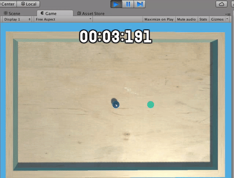

Our game is basically complete, but it would be nice if it had a pause overlay that pauses our game when you press `escape` and unpauses when you press `escape` again.

To do this, it’s helpful to know that calling `Time.timeScale = 0` is a handy way of making the physics in the game freeze, and `Time.timeScale = 1` is a handy way of making everything move again.

> [action]
>
Think you’re up for it?  Try implementing a pause overlay.
>


<!--  -->

> [solution]
>
We implemented the Pause mechanic by modifying ScenePlay to look like this:
>
```
using UnityEngine;
using System.Collections;
using UnityEngine.UI;
>
public class ScenePlay : MonoBehaviour {
>
  private float timer;
  public Text timerText;
  public Goal goal;
  private bool hasGameEnded;
  public GameObject overlayWin;
  public GameObject overlayPause;
>
  // Use this for initialization
  void Start () {
>
  }
>
  // Update is called once per frame
  void Update () {
>
    if (hasGameEnded && Time.timeScale != 0) {return;}
>
    if (Input.GetKeyDown(KeyCode.Escape)) {
      Time.timeScale = 0;
      overlayPause.SetActive(true);
    }
>
    timer += Time.deltaTime;
>
    int ms = (int)(((float)(timer - (int)timer)) * 1000);
    int m = (int)timer / 60;
    int s = (int)(timer - m * 60);
>
    string timeString = m.ToString("D2") + ":" + >s.ToString("D2") + ":" + ms.ToString("D3");
>
    timerText.text = timeString;
>
    hasGameEnded = goal.hasBeenReached;
>
    if (hasGameEnded) {
      overlayWin.SetActive(true);
    }
  }
}
```
>
Note that we’ve also changed our blocking condition at the beginning of our `Update` method to check if `Time.timeScale` is `0`. This is because, if the game is already paused, we don’t want to check any of our gameplay logic, especially not the logic that would let us make our pause overlay active.
>
We added a new component, which we named `UIOverlayPause`, to the `ovelayPause` Game Object we reference here. The `UIOverlayPause` component looks like this:
>
```
using UnityEngine;
using System.Collections;
>
public class UIOverlayPause : MonoBehaviour {
>
  // Use this for initialization
  void Start () {
>
  }
>
  // Update is called once per frame
  void Update () {
>
    if (Input.GetKeyDown(KeyCode.Escape)) {
      Time.timeScale = 1;
      gameObject.SetActive(false);
    }
  }
}
```
>
We’ve made the pause overlay responsible for unpausing and hiding itself, though this could also have been done from within ScenePlay if we had wanted. It’s a matter of preference.

# Wrapping up

Congratulations!  You now have a ball-in-maze puzzle!  All that’s left is to build the maze and tweak parameters as you see fit. Maybe you think the board tilts painfully slowly. Maybe players say the ball is too big. Maybe you just don’t like the way the background looks.

> [action]
>
Take a moment to at least build a maze and play around with your creation. If you would like, feel free to make the maze truly unique!
>


We’ve added some glass on top to prevent cheaters from flipping the ball over the walls, and added some UI to indicate controls to the players.

If you’d like to share this game with friends, open up the Build Settings and create a Build of the game to a folder somewhere using the Build button.
